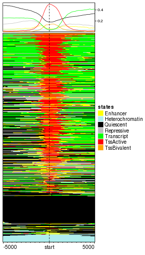
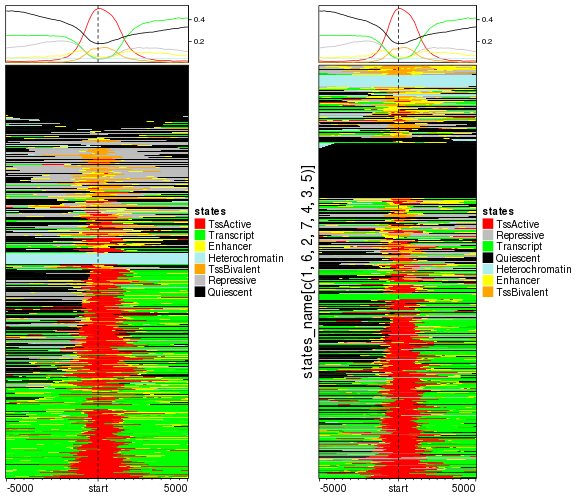
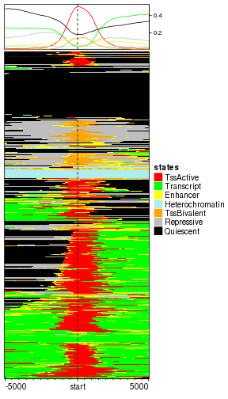
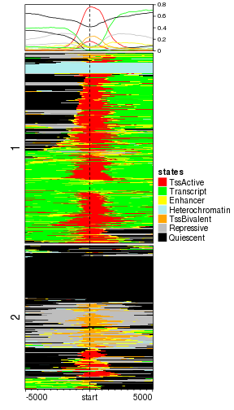
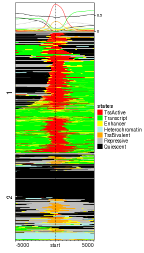
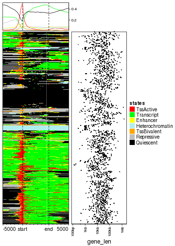
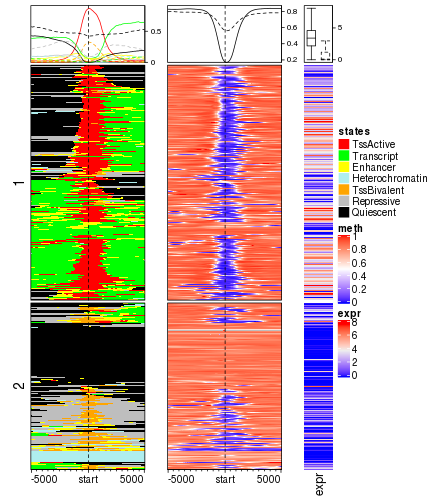
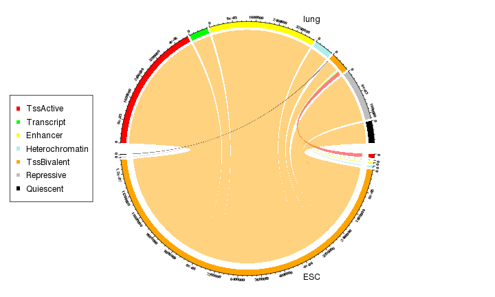
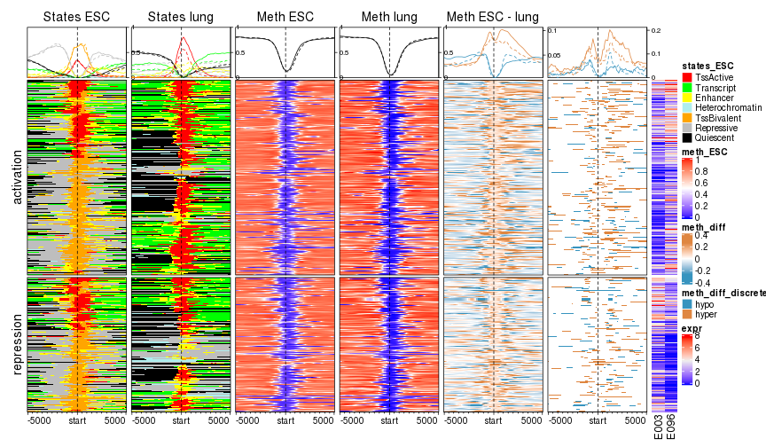

Visualize Categorical Signals
========================================

**Author**: Zuguang Gu ( z.gu@dkfz.de )

**Date**: 2018-11-10

-------------------------------------------------------------


Normally genomic signals are represented as numeric (e.g. methylation from
WGBS or histone modification intensity from ChIP-seq) or binary values (e.g.
existance of CpG islands in a given position), however, genomic signals
sometimes can also be represented as categorical or discrete values (mostly
stored as characters). A very typical example is chromatin states segmentation
by [ChromHMM](http://compbio.mit.edu/ChromHMM/). ChromHMM basically assigns a
chromatin state (e.g. active transcription state or repressive transcription
state) to a given window in the genome and the assignment of states in
different windows are always mutually exclusive (which means one window can
only have one state). In this vignette, We will demonstrate how to visualize
the enrichment of various chromatin states around certain genomic targets and
how to integerate with other epigenomic signals.

## General examples

In following example, we use [Roadmap
dataset](http://www.roadmapepigenomics.org/) as the example dataset. First we
show basic usages with using one sample (sample id: E003, embryonic stem cell,
H1 cell line).

Load packages:


```r
library(GenomicRanges)
library(data.table)
library(EnrichedHeatmap)
library(circlize)
```

The chromatin state segmentation is trained and applied from [five histone
modifications](http://egg2.wustl.edu/roadmap/web_portal/chr_state_learning.html#core_15state).
Following file in use is from
http://egg2.wustl.edu/roadmap/data/byFileType/chromhmmSegmentations/ChmmModels/coreMarks/jointModel/final/E003_15_coreMarks_mnemonics.bed.gz.

We convert to a `GRanges` object.


```r
states_bed = fread("zcat ~/EnrichedHeatmap_test/E003_15_coreMarks_mnemonics.bed.gz")
states = GRanges(seqnames = states_bed[[1]], 
	ranges = IRanges(states_bed[[2]] + 1, states_bed[[3]]), 
	states = states_bed[[4]])
unique(states_bed[[4]])
```

```
##  [1] "15_Quies"    "9_Het"       "14_ReprPCWk" "13_ReprPC"   "10_TssBiv"   "7_Enh"      
##  [7] "1_TssA"      "11_BivFlnk"  "2_TssAFlnk"  "5_TxWk"      "4_Tx"        "8_ZNF/Rpts" 
## [13] "6_EnhG"      "12_EnhBiv"   "3_TxFlnk"
```

In the 15 states, there are some states which are similar to each other such
as `1_TssA` (active TSS) and `2_TssAFlnk` (flanking active TSS). To reduce the
complexity of the analysis, we merge some of the similar states.


```r
map = c(
	"1_TssA"      = "TssActive",
	"2_TssAFlnk"  = "TssActive",
	"3_TxFlnk"    = "Transcript",
	"4_Tx"        = "Transcript",
	"5_TxWk"      = "Transcript",
	"6_EnhG"      = "Enhancer",
	"7_Enh"       = "Enhancer",
	"8_ZNF/Rpts"  = "Heterochromatin",
	"9_Het"       = "Heterochromatin",
	"10_TssBiv"   = "TssBivalent",
	"11_BivFlnk"  = "TssBivalent",
	"12_EnhBiv"   = "Enhancer",
	"13_ReprPC"   = "Repressive",
	"14_ReprPCWk" = "Repressive",
	"15_Quies"    = "Quiescent"
)
states$states_simplified = map[states$states]
```

Also we set the colors for the 7 merged states.


```r
states_col = c(
	"TssActive"       = "Red",
	"Transcript"      = "Green",
	"Enhancer"        = "Yellow",
	"Heterochromatin" = "PaleTurquoise",
	"TssBivalent"     = "Orange",
	"Repressive"      = "Grey",
	"Quiescent"       = "black"
)
states_name = names(states_col)
n_states = length(states_col)
```

In following, we demonstrate how to normalize the chromatin states to TSS.
First we load the transcriptome and extract TSS regions. The transcriptome
annotation is from
http://egg2.wustl.edu/roadmap/data/byDataType/rna/annotations/gen10.long.gtf.gz
and we only use protein coding genes. The database file (the `sqlite` file)
for transcriptome was generated by **GenomicFeatures** package (the
`makeTxDbFromGFF()` function).


```r
library(GenomicFeatures)
txdb = loadDb("~/EnrichedHeatmap_test/gencode19_protein_coding_txdb.sqlite")

g = genes(txdb)
tss = promoters(g, upstream = 0, downstream = 1)
```

To reduce the running time, here we only use chromosome 1. Normalizing categorical signals
is basically as same as numeric signals. Here we only need to specify the column name for
the categorical signals.


```r
tss_chr1 = tss[seqnames(tss) == "chr1"]
# column "states_simplified" is in character mode
mat_states = normalizeToMatrix(states, tss_chr1, value_column = "states_simplified")
mat_states
```

```
## Normalize states to tss_chr1:
##   Upstream 5000 bp (50 windows)
##   Downstream 5000 bp (50 windows)
##   Include target regions (width = 1)
##   2065 target regions
##   signal is categorical (7 levels)
```

In the last line of the message, it clarifies it is categorical signals with 7
levels.

The implementation of normalizing categorical signals is actually very simple.
Internally, `n_states` normalized matrices are generated where each one
corresponds to one chromatin state and the value in each window is the
fraction how much the window is overlapped to the state (with `w0` or
`weighted` mean mode). Since the i^th row and the j^th column in all matrices
correspond to a same window to a same target (here the TSS), if there are
multiple states overlap to this same window, when summarizing from all states,
the state with largest overlap fraction is assigned to this window.

Since the `normalizeToMatrix()` is called `n_states` times internally, it will
be a little bit slow to normalize to categorical signals.

There are some special visualizations designed for categorical signals where
each state is summarized and visualized separatedly in the top annotation.
Here `states_col` must be a named vector where the names should correspond to
the levels of the categorical signals.


```r
EnrichedHeatmap(mat_states, name = "states", col = states_col)
```



You might feel the row ordering is a little bit in a mess. Although the
signals are categorical, internally, there are coded as integer numbers. Just
similar as how **factor** in R is stored, each categorical level corresponds
to an integer number. If the signal column is simply a character vector, the
assignment of integers are based on the natural ordering of this character
vector. Thus the numeric coding for signals in `states` object is:


```r
data.frame(states = unique(states$states_simplified), value = 1:7)
```

```
##            states value
## 1       Quiescent     1
## 2 Heterochromatin     2
## 3      Repressive     3
## 4     TssBivalent     4
## 5        Enhancer     5
## 6       TssActive     6
## 7      Transcript     7
```

Zero is assigned to a window if none of the states overlap to it and it is
drawn with white.

The numeric coding can be controlled by setting the signals as a factor
variable and the level order of the factor controls the corresponding coding.
In following code, we convert `states_simplified` as a factor with specifying
the level order.


```r
states$states_simplified = factor(states$states_simplified, levels = states_name)
data.frame(states = levels(states$states_simplified), value = 1:7)
```

```
##            states value
## 1       TssActive     1
## 2      Transcript     2
## 3        Enhancer     3
## 4 Heterochromatin     4
## 5     TssBivalent     5
## 6      Repressive     6
## 7       Quiescent     7
```

Note here the order of `states_name` also reflects the closeness of different
states. With the order defined above, `TssActive` is closer to `Transcript` and
`Repressive` is closer to `Quiescent`. 

In following left plot, the TSS with active states now are far from the TSS with
repressive states. In the right plot we change the level of `states_simplified` and you can compare to the left one.


```r
mat_states = normalizeToMatrix(states, tss_chr1, value_column = "states_simplified")
EnrichedHeatmap(mat_states, name = "states", col = states_col)
# shuffle levels for states_simplified
states$states_simplified = factor(states$states_simplified, 
	levels = states_name[c(1, 6, 2, 7, 4, 3, 5)])
mat_states = normalizeToMatrix(states, tss_chr1, value_column = "states_simplified")
EnrichedHeatmap(mat_states, name = "states", col = states_col, 
	row_title = "states_name[c(1, 6, 2, 7, 4, 3, 5)]")
```



We suggest to apply hierarchical clustering to reorder rows. Here the numeric
coding is espeically important because it affects the calculation of distance
between rows.


```r
# we change the level back
states$states_simplified = factor(states$states_simplified, levels = states_name)
mat_states = normalizeToMatrix(states, tss_chr1, value_column = "states_simplified")
EnrichedHeatmap(mat_states, name = "states", col = states_col, cluster_rows = TRUE)
```



Since the normalized matrix is numeric, k-means clustering can also be
applied.


```r
EnrichedHeatmap(mat_states, name = "states", col = states_col, cluster_rows = TRUE, row_km = 2)
```



After closely looking at the heatmap, we found the TSS states are consistently
enriched around TSS while in the flanking regions, the states are a little bit
diverse. Actually this suggests that in order to enhance the pattern of the
TSS-related states, we can apply k-means clustering only for the states near
TSS regions.

In following we only cluster the sub-matrix which is upstrean and downstream
1kb of TSS (The default extension of TSS is 5kb upstream and downstream, the
number of columns in the normalized matrix is 100, thus from 40^th column to
60^th column are the states in 1kb upstream and downstream of TSS).

Of couse we need to calculate this partitioning in advance.


```r
split = kmeans(mat_states[, 40:60], centers = 2)$cluster
EnrichedHeatmap(mat_states, name = "states", col = states_col, cluster_rows = TRUE, 
	row_split = split)
```



Now it is quite nice to see genes with active TSS are all clustered in cluster 2 while in cluster 1, genes are
either have no function or have bivalent TSS function.

Similarly, we can visualize how the chromatin states enriched at gene bodies. Since the gene bodies have
unequal widths, we add an additional point plot to show the width of genes.


```r
g_chr1 = g[seqnames(g) == "chr1"]
mat_states_2 = normalizeToMatrix(states, g_chr1, value_column = "states_simplified")
EnrichedHeatmap(mat_states_2, name = "states", col = states_col, cluster_rows = TRUE) +
rowAnnotation(gene_len = anno_points(log10(width(g_chr1) + 1), size = unit(1, "mm"),
	axis = TRUE, axis_param = list(at = c(2, 3, 4, 5, 6), 
		labels = c("100bp", "1kb", "10kb", "100kb", "1mb")), 
	width = unit(4, "cm")))
```



Next we add methylation around TSS as well as expression for the corresponding
genes. Expression data is from
http://egg2.wustl.edu/roadmap/data/byDataType/rna/expression/57epigenomes.RPKM.pc.gz
and methylation data is from
http://egg2.wustl.edu/roadmap/data/byDataType/dnamethylation/WGBS/FractionalMethylation.tar.gz

In following, the raw methylation data has been smoothed by **bsseq** package.
The rds file was generated by the old version of **bsseq** package that is why
we used a strange way to extract the positions of CpG sites as well as
smoothed methylation data which can be replaced by using `granges()` and
`getMeth()` functions if the smoothing is applied with newest version of
**bsseq** package.


```r
expr = read.table("~/EnrichedHeatmap_test/57epigenomes.RPKM.pc.gz", row.names = 1, header = TRUE)
expr = as.matrix(expr)
obj = readRDS("~/EnrichedHeatmap_test/chr1_roadmap_merged_bsseq.rds")
meth = obj@rowData
meth_mat = obj@trans(obj@assays$data$coef)
mcols(meth) = meth_mat
```

We take the genes which exist both in `tss_chr1` and `expr`.


```r
names(tss_chr1) = gsub("\\.\\d+$", "", names(tss_chr1))
cn = intersect(names(tss_chr1), rownames(expr))
tss_chr1 = tss_chr1[cn]
expr = expr[cn, ]
```

We normalize chromatin states as well methylation to TSS on chromosome 1.


```r
mat_states = normalizeToMatrix(states, tss_chr1, value_column = "states_simplified")
mat_meth = normalizeToMatrix(meth, tss_chr1, value_column = "E003", mean_mode = "absolute",
	smooth = TRUE)
```

Similarly, k-means is applied on chromatin states 1kb upstream and downstream
of TSS. Note since the rows are split into two sub-cluster, we add
`anno_summary()` to the expression matrix to show the distribution of
expression in the two sub-clusters.


```r
split = kmeans(mat_states[, 40:60], centers = 2)$cluster
meth_col_fun = colorRamp2(c(0, 0.5, 1), c("blue", "white", "red"))
ht_list = EnrichedHeatmap(mat_states, name = "states", col = states_col, cluster_rows = TRUE, 
	row_split = split, 
	top_annotation = HeatmapAnnotation(enrich = anno_enriched(gp = gpar(lty = 1:2)))) +
EnrichedHeatmap(mat_meth, name = "meth", col = meth_col_fun,
	top_annotation = HeatmapAnnotation(enrich = anno_enriched(gp = gpar(lty = 1:2)))) +
Heatmap(log2(expr[names(tss_chr1), "E003"] + 1), name = "expr", 
	show_row_names = FALSE, width = unit(1, "cm"),
	top_annotation = HeatmapAnnotation(summary = anno_summary(gp = gpar(lty = 1:2),
		outline = FALSE, axis_param = list(side = "right"))))
draw(ht_list, ht_gap = unit(8, "mm"))
```



With corresponding to more epigenomic signals, we can see promoters with
active TSS states are always associated with low methylation and high gene
expression while promoters annotated as bivalent states or repressed are
generally more lowly expressed.

## Bivalent TSS

It is believed that in embryonic stem cell, there are a huge number of genes
showing bivalency states on promoters. They are called bivalent states because
both H3K4me3 which is a histone mark for active transcription and H3K27me3
which is for repressive transcription exist. The loss/gain of active histone
mark or repressive histone mark which transite into mature cells is essential
for tissue development and differentiation.

To demonstate this, we anlaysis such transitions for one mature tissue (lung tissue,
roadmap sample id: E096).


```r
states_bed = fread("zcat ~/EnrichedHeatmap_test/E096_15_coreMarks_mnemonics.bed.gz")
states_lung = GRanges(seqnames = states_bed[[1]], ranges = IRanges(states_bed[[2]] + 1, states_bed[[3]]), 
	states = states_bed[[4]])
states_lung$states_simplified = factor(map[states_lung$states], levels = states_name)
```

ChromHMM is performed with 200bp window, thus we split whole genome by 200bp
window and assign corresponding states to each window, both for ESC and lung.


```r
window = makeWindows(states, w = 200)
mtch = as.matrix(findOverlaps(window, states))
window$ESC_states = states$states_simplified[mtch[, 2]]
mtch = as.matrix(findOverlaps(window, states_lung))
window$lung_states = states_lung$states_simplified[mtch[, 2]]
```

We only use the windows which are annotated with `TssBivalent` state either in
ESC or in lung.


```r
window = window[window$ESC_states == "TssBivalent" | window$lung_states == "TssBivalent"]
```

We first make a Chord diagram to show how the transsition happens.


```r
transition_mat = table(mcols(window)[, c("ESC_states", "lung_states")]) * 200
class(transition_mat) = "matrix"
transition_mat = transition_mat[states_name, states_name]
transition_mat
```

```
##                  lung_states
## ESC_states        TssActive Transcript Enhancer Heterochromatin TssBivalent Repressive Quiescent
##   TssActive               0          0        0               0      136200          0         0
##   Transcript              0          0        0               0        8200          0         0
##   Enhancer                0          0        0               0       38800          0         0
##   Heterochromatin         0          0        0               0       55800          0         0
##   TssBivalent       4485600     665400  3711800          653000      406000    1799200    766200
##   Repressive              0          0        0               0       24600          0         0
##   Quiescent               0          0        0               0       23800          0         0
```

The values in the transition matrix mean how many base pairs change from one
chromatin state to the other state.

Rows and columns are from different cells, we add prefix to row and column
names.


```r
rownames(transition_mat) = paste0("ESC_", rownames(transition_mat))
colnames(transition_mat) = paste0("lung_", colnames(transition_mat))
```

Now we make the Chord diagram.


```r
grid.col = c(states_col, states_col)
names(grid.col) = c(rownames(transition_mat), colnames(transition_mat))
chordDiagram(transition_mat, grid.col = grid.col, annotationTrack = c("grid", "axis"),
	directional = TRUE, gap.degree = 5)
circos.clear()
text(0.5, -1, "ESC")
text(0.5, 1, "lung")
legend("left", pch = 15, col = states_col, legend = names(states_col))
```



As we can see from the Chord diagram, a lot of regions with bivalent TSS
states (orange track at bottom) have been tansite to active (red track on top)
or repressive states (grey track on top) in lung.

To get more deep of how the transistion looks like, we can make enriched
heatmaps to see the associations between different epigenomic signals.

Since `TssBivalent` states basically are states for TSS related regions, we
only keep genes for which in 1kb upstream and downstream of TSS there must be
a window with TssBivalent state. Again, we only use chromosome 1 as
demonstration.


```r
mat_bivtss = normalizeToMatrix(states[states$states_simplified == "TssBivalent"], tss_chr1)
l = rowSums(mat_bivtss[, 40:60]) > 0 # 1kb upstream and downstream
tss_biv = tss_chr1[l]
tss_biv
```

```
## GRanges object with 443 ranges and 1 metadata column:
##                   seqnames                 ranges strand |           gene_id
##                      <Rle>              <IRanges>  <Rle> |       <character>
##   ENSG00000000938     chr1 [ 27961788,  27961788]      - | ENSG00000000938.8
##   ENSG00000006555     chr1 [ 55266940,  55266940]      - | ENSG00000006555.6
##   ENSG00000007968     chr1 [ 23857712,  23857712]      - | ENSG00000007968.6
##   ENSG00000008118     chr1 [209757062, 209757062]      + | ENSG00000008118.5
##   ENSG00000009709     chr1 [ 18957500,  18957500]      + | ENSG00000009709.7
##               ...      ...                    ...    ... .               ...
##   ENSG00000243749     chr1 [ 35450954,  35450954]      - | ENSG00000243749.1
##   ENSG00000248485     chr1 [161228517, 161228517]      + | ENSG00000248485.1
##   ENSG00000249087     chr1 [ 23695711,  23695711]      + | ENSG00000249087.3
##   ENSG00000251246     chr1 [155036224, 155036224]      + | ENSG00000251246.1
##   ENSG00000253304     chr1 [ 29450447,  29450447]      - | ENSG00000253304.1
##   -------
##   seqinfo: 25 sequences from an unspecified genome; no seqlengths
```

We normalize chromatin states and methylation to `tss_biv`.


```r
mat_states_ESC = normalizeToMatrix(states, tss_biv, value_column = "states_simplified")
mat_states_lung = normalizeToMatrix(states_lung, tss_biv, value_column = "states_simplified")

mat_meth_ESC = normalizeToMatrix(meth, tss_biv, value_column = "E003", mean_mode = "absolute",
	smooth = TRUE)
mat_meth_lung = normalizeToMatrix(meth, tss_biv, value_column = "E096", mean_mode = "absolute",
	smooth = TRUE)
```

Normally, methylation changes happen at the border of low methylation region. To enhance the effect
of methylation change, we directly visualize the methyaltion difference.


```r
mat_meth_diff = mat_meth_ESC - mat_meth_lung
meth_diff_col_fun = colorRamp2(c(-0.25, 0, 0.25), c("#3794bf", "#FFFFFF", "#df8640"))
```

Now we construct the heatmap list.


```r
ht_list = EnrichedHeatmap(mat_states_ESC, name = "states_ESC", col = states_col,
	top_annotation = HeatmapAnnotation(enrich = anno_enriched(gp = gpar(lty = 1:2), ylim = c(0, 1))),
	column_title = "States ESC") +
EnrichedHeatmap(mat_states_lung, name = "states_lung", col = states_col,
	top_annotation = HeatmapAnnotation(enrich = anno_enriched(gp = gpar(lty = 1:2), ylim = c(0, 1))),
	show_heatmap_legend = FALSE, column_title = "States lung")

ht_list = ht_list + EnrichedHeatmap(mat_meth_ESC, name = "meth_ESC", col = meth_col_fun,
	top_annotation = HeatmapAnnotation(enrich = anno_enriched(gp = gpar(lty = 1:2), ylim = c(0, 1))),
	column_title = "Meth ESC") +
EnrichedHeatmap(mat_meth_lung, name = "meth_lung", col = meth_col_fun,
	top_annotation = HeatmapAnnotation(enrich = anno_enriched(gp = gpar(lty = 1:2), 
		ylim = c(0, 1))),
	show_heatmap_legend = FALSE, column_title = "Meth lung") +
EnrichedHeatmap(mat_meth_diff, name = "meth_diff", col = meth_diff_col_fun,
	top_annotation = HeatmapAnnotation(enrich = anno_enriched(gp = gpar(lty = 1:2, 
		pos_col = "#df8640", neg_col = "#3794bf"))),
	column_title = "Meth ESC - lung")
```

Actually we can discretize the numeric `mat_meth_diff`. Here we assign `hyper` to windows with methylation 
difference larger than 0.2 and `hypo` to windows with methylation difference less than -0.2. Here `discretize()` converts
a matrix with continuous signals to categorical signals by prividing a list of intervals.


```r
mat_meth_diff_discrete = discretize(mat_meth_diff,
	rule = list(
		"hypo" = c(-Inf, -0.2),
		"hyper" = c(0.2, Inf)
	)
)
mat_meth_diff_discrete
```

```
## Normalize  to tss_biv:
##   Upstream 5000 bp (50 windows)
##   Downstream 5000 bp (50 windows)
##   Include target regions (width = 1)
##   443 target regions
##   signal is categorical (2 levels)
```

We continue to add more heatmaps.


```r
ht_list = ht_list + EnrichedHeatmap(mat_meth_diff_discrete, name = "meth_diff_discrete", 
	col = c("hyper" = "#df8640", hypo = "#3794bf"),
	top_annotation = HeatmapAnnotation(enrich = anno_enriched(gp = gpar(lty = 1:2))))
```

Finally the heatmap for gene expression.


```r
e = log2(expr[names(tss_biv), c("E003", "E096")] + 1)
ht_list = ht_list + Heatmap(e, name = "expr", 
	show_row_names = FALSE, width = unit(10, "mm"), cluster_columns = FALSE)
```

The row ordering for all heatmaps is from hierarchical clustering on the merged matrix from states in ESC and lung, 1kb upstream and downstream of TSS.


```r
row_order = hclust(dist(cbind(mat_states_ESC[, 40:60], mat_states_lung[, 40:60])))$order
split = ifelse(e[, "E096"] > e[, "E003"], "activation", "repression")
draw(ht_list, row_order = row_order, row_split = split)
```



What conclusion can you make from the plot? I can only say the regulation pattern is really complicated there :).

## Other examples

There are some other examples where the genomic signals are categorical.

1. repeats where different repeat family can be different categories,
2. genome segmentation based on methylation. E.g. hign methylated regions (HMRs),
   partially methylated regions (PMDs), low methylated regions (LMRs), unmethylated regions (UMRs),
3. for gene-related regions, genic annotation is also categorical.

## Session Info


```r
sessionInfo()
```

```
## R version 3.3.1 (2016-06-21)
## Platform: x86_64-pc-linux-gnu (64-bit)
## Running under: openSUSE 13.1 (Bottle) (x86_64)
## 
## locale:
##  [1] LC_CTYPE=en_GB.UTF-8       LC_NUMERIC=C               LC_TIME=en_GB.UTF-8       
##  [4] LC_COLLATE=en_GB.UTF-8     LC_MONETARY=en_GB.UTF-8    LC_MESSAGES=en_GB.UTF-8   
##  [7] LC_PAPER=en_GB.UTF-8       LC_NAME=C                  LC_ADDRESS=C              
## [10] LC_TELEPHONE=C             LC_MEASUREMENT=en_GB.UTF-8 LC_IDENTIFICATION=C       
## 
## attached base packages:
##  [1] grid      parallel  stats4    stats     graphics  grDevices utils     datasets  methods  
## [10] base     
## 
## other attached packages:
##  [1] GenomicFeatures_1.26.4 AnnotationDbi_1.36.2   Biobase_2.34.0         circlize_0.4.5        
##  [5] EnrichedHeatmap_1.13.1 ComplexHeatmap_1.99.0  data.table_1.10.4      GenomicRanges_1.26.4  
##  [9] GenomeInfoDb_1.10.3    IRanges_2.8.2          S4Vectors_0.12.2       BiocGenerics_0.20.0   
## [13] markdown_0.8           knitr_1.20             colorout_1.2-0        
## 
## loaded via a namespace (and not attached):
##  [1] Rcpp_0.12.18               highr_0.7                  RColorBrewer_1.1-2        
##  [4] XVector_0.14.1             bitops_1.0-6               tools_3.3.1               
##  [7] zlibbioc_1.20.0            biomaRt_2.30.0             evaluate_0.11             
## [10] RSQLite_1.0.0              lattice_0.20-34            png_0.1-7                 
## [13] Matrix_1.2-7.1             DBI_1.0.0                  rtracklayer_1.34.2        
## [16] stringr_1.3.1              Biostrings_2.42.1          GlobalOptions_0.1.0       
## [19] locfit_1.5-9.1             GetoptLong_0.1.7           BiocParallel_1.8.2        
## [22] XML_3.98-1.16              magrittr_1.5               GenomicAlignments_1.10.1  
## [25] Rsamtools_1.26.2           matrixStats_0.54.0         SummarizedExperiment_1.4.0
## [28] shape_1.4.4                colorspace_1.3-2           stringi_1.2.4             
## [31] RCurl_1.95-4.8             rjson_0.2.20
```

